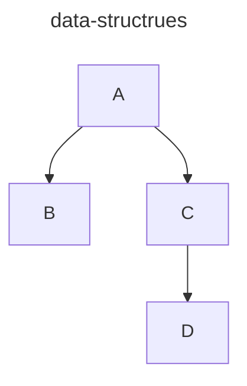

# data-structure-exercises
A collection of data structure exercises written in JS/TS for demonstration purposes. 
This includes a mermaid markdown generator class to dynamically generate diagrams of the data 
structures that can be viewed in any text editor that supports markdown (`.md`) with the `mermaid`
syntax. (GitHub supports this by default.)



---

## Contents

1. [Binary Trees](src%2Fbinary-trees%2FREADME.md)
2. Graphs (Coming Soon)


---

### Requirements
* NodeJS
* TypeScript
* jest 
* ts-jest
* @types/jest
* A text editor that supports markdown with mermaid syntax. (I use PHPStorm)


---

### Setup and Execution
This is a simple app for demo purposes. At this time, there is no front end, no bundlers, etc. 
As such, you will need to compile this and execute it with node in order to see it work. 

#### To get started:

Clone the repo
```shell
git clone https://TerryLeeAllenJr/data-structure-exercises
```
Install the required packages
```shell
npm install --save-dev 
```

Build the application
```shell
npm run build
```
To run the application, simply run the compiled JS with node.
```shell
node /[PATH]/[TO]/[REPO]/dist/index.js
```
---
