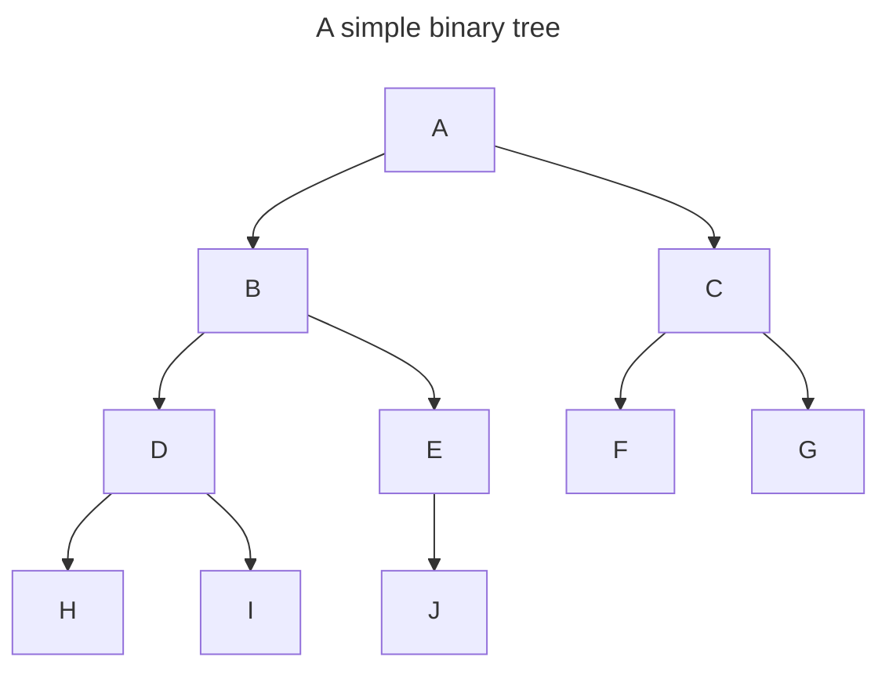

# Binary Trees

### Simple Binary Tree
In its simplest form, the binary tree is a data structure with the following properties:
* There is a single (root) node.
* Each node may have a maximum of 2 child (branch) nodes.
* Child nodes are referenced (linked) via `left` and `right` properties within the parent node.
    * In cases of nodes with empty branches, the `left` or `right` property will be `null`.

#### Caveats:

Simple binary trees require full traversal for min/max, search, and height calculations. For example, if you wanted to
find node "E", you would have to start with the `root` node "A", and traverse the entire tree using either the `Depth First`
or `Breadth First` traversal methods.
___

### Binary Search Trees
Binary search trees are a specific form of binary tree data structure, with the following requirements to optimize
search speed.

* The left subtree of a node contains only nodes with keys lesser than the node’s key.
* The right subtree of a node contains only nodes with keys greater than the node’s key.
* The left and right subtree each must also be a binary search tree.
* There are no duplicate nodes.

---

### Setup
